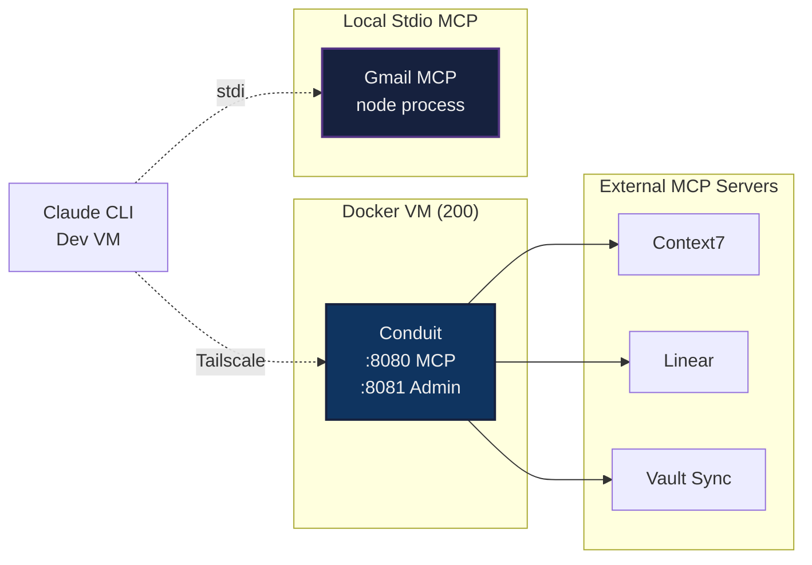

# MCP (Model Context Protocol)

Setup for AI agent access to homelab services and external APIs via Model Context Protocol.

## Architecture



## Components

### Conduit
HTTP-based MCP proxy that routes Claude to multiple downstream MCP servers with per-user permissions and audit logging.

- **Repo**: [github.com/alexjbarnes/conduit](https://github.com/alexjbarnes/conduit)
- **Host**: Docker VM (192.168.0.137 / Tailscale 100.77.12.68)
- **MCP port**: 8080 (path `/mcp`)
- **Admin UI port**: 8081
- **Access**:
  - LAN: `http://conduit.lan` (Caddy reverse proxy)
  - Tailscale: `http://100.77.12.68:8080/mcp` (direct, no `tailscale serve` needed thanks to subnet routing)

### Downstream Servers (via Conduit)
| Server | Type | Notes |
|--------|------|-------|
| Context7 | HTTP | Documentation lookup for libraries |
| Linear | HTTP | Linear workspace access |
| Vault Sync | HTTP | Obsidian vault read/write |

### Gmail MCP (Local stdio)
Google's official Gmail MCP API requires Google Workspace Developer Preview Program enrollment and rejects personal Gmail accounts. The community `@gongrzhe/server-gmail-autoauth-mcp` package works with personal accounts via standard Gmail API.

- **Runs**: Locally on the same machine as Claude CLI (stdio transport, not HTTP)
- **Why not Conduit**: Conduit only speaks HTTP to downstream servers, stdio MCP servers can't be routed through it without a bridge.

## Claude CLI Config

`~/.claude.json` excerpt:

```json
{
  "mcpServers": {
    "conduit": {
      "type": "http",
      "url": "http://100.77.12.68:8080/mcp",
      "headers": {
        "Authorization": "Bearer cnd_<token>"
      }
    },
    "gmail": {
      "type": "stdio",
      "command": "npx",
      "args": ["-y", "@gongrzhe/server-gmail-autoauth-mcp"]
    }
  }
}
```

## Setup Guides
- [Conduit installation and OAuth setup](conduit.md)
- [Gmail MCP setup](gmail.md)
- [Claude CLI config recovery](claude-mcp-config.md) — restore the `mcpServers` block after an update wipes it
