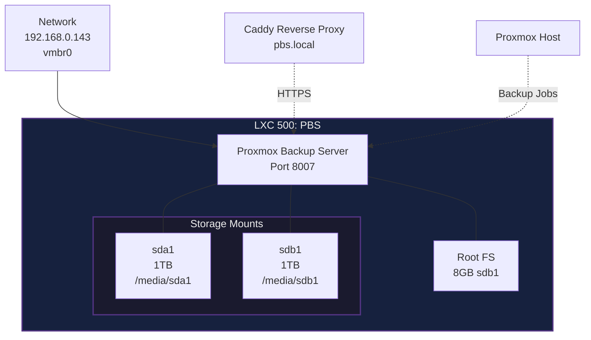

# LXC 500: Proxmox Backup Server

## Network
- **IP Address**: 192.168.0.143
- **Gateway**: 192.168.0.1
- **DNS**: 1.1.1.1
- **Hostname**: PBS
- **MAC Address**: BC:24:11:FC:F0:60

## Resources
- **CPU**: 1 Core
- **Memory**: 2GB RAM
- **Swap**: 0GB
- **Root Filesystem**: 8GB (sdb1)

## Storage Mounts
- **sda1**: 1TB storage (mounted at /media/sda1)
- **sdb1**: 1TB storage (mounted at /media/sdb1)

## Configuration
- **Architecture**: amd64
- **OS Type**: Debian
- **Features**: Nesting enabled
- **Privileged**: No (unprivileged container)
- **Auto Start**: Yes

## Services
- **Proxmox Backup Server**: Web UI on port 8007
- **Purpose**: Backup storage for VMs and LXCs

## DNS Routes
- **pbs.local** → 192.168.0.143:8007
