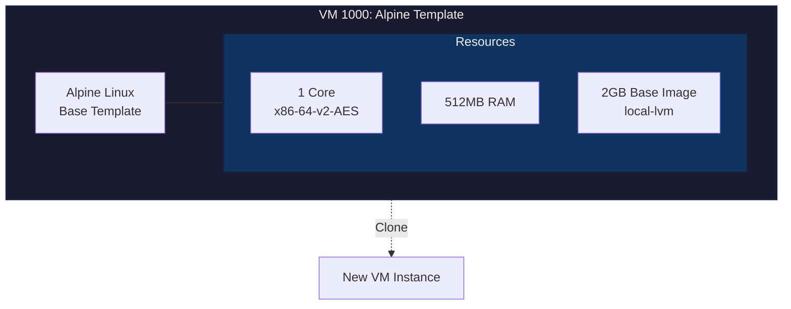

# VM 1000: Alpine Template

## Network
- **MAC Address**: BC:24:11:65:9A:EA
- **Bridge**: vmbr0

## Resources
- **CPU**: 1 Core (x86-64-v2-AES)
- **Memory**: 512MB RAM
- **Boot Disk**: 2GB (local-lvm, base image)

## Configuration
- **Name**: AlpineVmTemplate
- **BIOS**: OVMF (UEFI)
- **OS Type**: Linux 2.6+ Kernel
- **SCSI Controller**: VirtIO SCSI Single
- **QEMU Agent**: Enabled
- **NUMA**: Disabled
- **Template**: Yes

## Purpose
Base Alpine Linux template for cloning new lightweight VMs.
