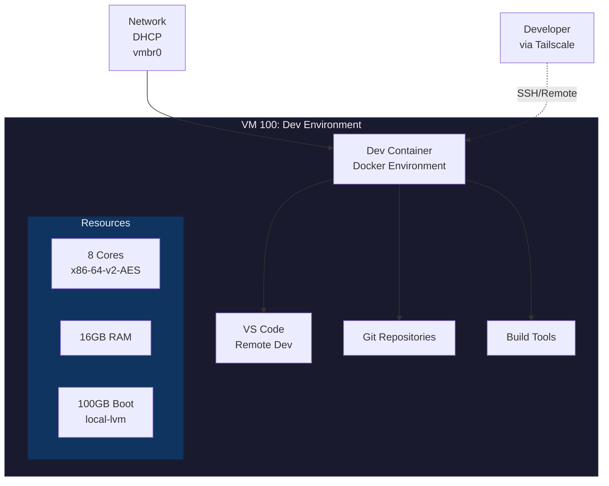

# VM 100: Dev Environment

## Network
- **IP Address**: DHCP assigned
- **MAC Address**: BC:24:11:FB:9F:25
- **Bridge**: vmbr0

## Resources
- **CPU**: 8 Cores (x86-64-v2-AES)
- **Memory**: 16GB RAM
- **Boot Disk**: 100GB (local-lvm)

## Configuration
- **Name**: Dev-VM
- **BIOS**: OVMF (UEFI)
- **OS Type**: Linux 2.6+ Kernel
- **SCSI Controller**: VirtIO SCSI Single
- **Auto Start**: Yes
- **QEMU Agent**: Enabled
- **NUMA**: Disabled

## Purpose
Development container host for testing and building applications.

## Services
- **Dev Container**: Docker-based development environment
