# VM 200: Docker Host

```mermaid
graph TB
    Network[Network<br/>192.168.0.137<br/>vmbr0]
    Internet[Internet] -.Tailscale VPN.-> Network
    
    subgraph VM200["VM 200: Docker Host"]
        subgraph Hardware["Hardware"]
            CPU[4 Cores<br/>Host CPU]
            RAM[8GB RAM]
            GPU[Intel iGPU<br/>HW Transcode]
            USB1[USB: Canon Printer]
            USB2[USB: 8087:0033]
        end
        
        subgraph Storage["Storage"]
            Boot[Boot: 100GB<br/>local-lvm]
            Data1[Data: 2TB<br/>scsi1]
            Data2[Data: 4.1TB<br/>scsi2]
        end
        
        Caddy[Caddy<br/>80/443]
        
        subgraph Infrastructure["Infrastructure"]
            Komodo[Komodo Core<br/>:9120]
            Periphery[Komodo Periphery]
            Mongo[(MongoDB)]
            Komodo --- Mongo
        end
        
        subgraph Media["Media Services"]
            Jellyfin[Jellyfin<br/>GPU Transcode]
            Debrid[Debrid DL<br/>:3333]
            Immich[Immich Photos]
            Frigate[Frigate NVR]
        end
        
        subgraph Network_Services["Network"]
            PiHole[Pi-hole<br/>:53, :880]
        end
        
        subgraph Productivity["Productivity"]
            Vikunja[Vikunja<br/>:3456]
            Mealie[Mealie<br/>:9925]
            Wallabag[Wallabag<br/>:8880]
            Kanbn[Kanbn]
        end
        
        subgraph Admin["Admin"]
            PgAdmin[pgAdmin<br/>:8080]
            Backrest[Backrest]
            PrintScan[Print/Scan]
        end
        
        Caddy --> Komodo
        Caddy --> Debrid
        Caddy --> Vikunja
        Caddy --> PiHole
        Caddy --> Mealie
        Caddy --> Wallabag
        
        GPU -.-> Jellyfin
        USB1 -.-> PrintScan
        Data1 -.Media Storage.-> Jellyfin
        Data1 -.Media Storage.-> Debrid
    end
    
    Network --> Caddy
    PiHole -.DNS.-> Network
    
    style VM200 fill:#0f3460,stroke:#16213e,stroke-width:2px,color:#eee
    style Hardware fill:#1a1a2e,stroke:#e94560,stroke-width:2px,color:#eee
    style Storage fill:#1a1a2e,stroke:#e94560,stroke-width:2px,color:#eee
    style Infrastructure fill:#16213e,stroke:#e94560,stroke-width:2px,color:#eee
    style Media fill:#16213e,stroke:#e94560,stroke-width:2px,color:#eee
    style Network_Services fill:#16213e,stroke:#e94560,stroke-width:2px,color:#eee
    style Productivity fill:#16213e,stroke:#e94560,stroke-width:2px,color:#eee
    style Admin fill:#16213e,stroke:#e94560,stroke-width:2px,color:#eee
```

## Network
- **IP Address**: 192.168.0.137
- **Gateway**: 192.168.0.1 (via vmbr0)
- **Hostname**: Docker
- **MAC Address**: BC:24:11:C0:69:4D

## Resources
- **CPU**: 4 Cores (host CPU type)
- **Memory**: 8GB RAM
- **Boot Disk**: 100GB (local-lvm)

## Hardware Passthrough
- **GPU**: Intel iGPU (PCI 0000:00:02)
  - Used for Jellyfin hardware transcoding
- **USB Devices**:
  - 8087:0033 (USB device)
  - 04a9:18bb (Canon printer/scanner)

## Storage
- **scsi0**: 100GB boot disk (local-lvm)
- **scsi1**: 2TB data disk (sda1)
- **scsi2**: 4.1TB data disk (sda1)

## VirtioFS Mounts
- backrest_sda1
- backrest_sdb1
- PVE_CONFIG

## Configuration
- **BIOS**: OVMF (UEFI)
- **OS Type**: Linux 2.6+ Kernel
- **SCSI Controller**: VirtIO SCSI Single
- **Auto Start**: Yes
- **QEMU Agent**: Enabled

## Services

### Reverse Proxy
- **Caddy**: Ports 80/443 (local TLS certificates)

### Infrastructure Management
- **Komodo Core**: Port 9120
- **Komodo Periphery**: Docker socket monitoring
- **MongoDB**: Database for Komodo

### Media Services
- **Jellyfin**: Host network mode, GPU hardware acceleration
- **Debrid Downloader**: Port 3333
- **Immich**: Photo management
- **Frigate**: NVR for security cameras

### Network Services
- **Pi-hole**: DNS/ad-blocking (ports 53, 880)

### Productivity Apps
- **Vikunja**: Task management (port 3456)
- **Mealie**: Recipe manager (port 9925)
- **Wallabag**: Read-it-later (port 8880)
- **Kanbn**: Kanban board

### Admin Tools
- **pgAdmin**: PostgreSQL admin (port 8080)
- **Backrest**: Backup solution
- **Print/Scan Server**: Canon printer driver support

## DNS Routes
- **komodo.local** → 192.168.0.137:9120
- **debrid.local** → 192.168.0.137:3333
- **vikunja.local** → 192.168.0.137:3456
- **pihole.local** → 192.168.0.137:880
