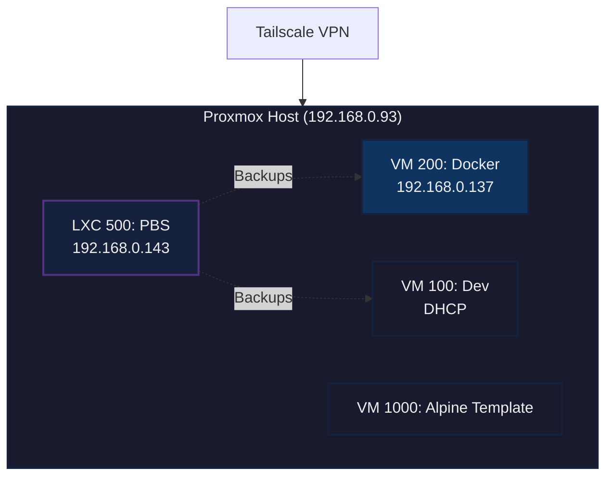

# HomeLab Infrastructure

## Overview

This HomeLab runs on Proxmox and consists of:

### Devices
- [LXC 500: Proxmox Backup Server](LXCs/Proxmox%20Backup%20Server/specs.md) (192.168.0.143)
- [VM 200: Docker Host](VMs/Docker/specs.md) (192.168.0.137)
- [VM 100: Dev Environment](VMs/Dev%20VM/specs.md) (DHCP)
- [VM 1000: Alpine Template](VMs/Alpine%20Template/specs.md)

### Network Access
External access is secured via Tailscale VPN on the Proxmox host. No ports exposed to internet.

All services route through Caddy reverse proxy with local DNS entries configured in Pi-hole for convenient .local domain access.
