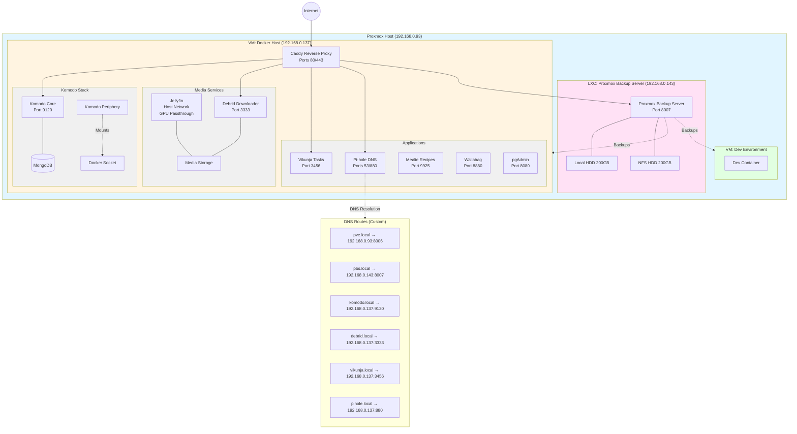

# HomeLab Infrastructure

## Overview

This HomeLab runs on Proxmox and consists of:

### LXC Container
- **Proxmox Backup Server (192.168.0.143)** - Dual 200GB storage (local + NFS)

### Docker VM (192.168.0.137)
- **Caddy** - Reverse proxy handling TLS termination
- **Komodo Stack** - Infrastructure management (Core + Periphery + MongoDB)
- **Media Services** - Jellyfin with GPU passthrough, Debrid downloader
- **Pi-hole** - DNS/ad-blocking
- **Productivity Apps** - Vikunja, Mealie, Wallabag, pgAdmin

### Dev VM
- Development container environment

All services route through Caddy with local DNS entries configured in Pi-hole for convenient .local domain access.
